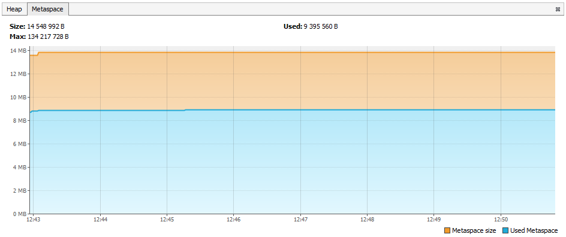

## HelloCDS

Если прикладные классы указаны в манифесте JAR-ки через атрибут, например:
```properties
Class-Path: slf4j-api-1.7.25.jar slf4j-simple-1.7.25.jar
```
, то они корректно распознаются и загружаются AppCDS'ом:
```text
toparvion@ArtStation:/mnt/c/lang/mysamples/project-uprise/hellocds$ ./bin/run-with-jsa.sh
[0.015s][info][class,path] bootstrap loader class path=/usr/lib/jvm/java-11-openjdk-amd64/lib/modules
[0.018s][info][class,path] opened: /usr/lib/jvm/java-11-openjdk-amd64/lib/modules
[0.032s][info][class,path] type=BOOT
[0.032s][info][class,path] Expecting BOOT path=/usr/lib/jvm/java-11-openjdk-amd64/lib/modules
[0.033s][info][class,path] ok
[0.033s][info][class,path] type=APP
[0.033s][info][class,path] Expecting -Djava.class.path=jar/hellocds.jar
[0.033s][info][class,path]
[0.034s][info][class,path] ok
[0.058s][info][class,path] checking shared classpath entry: /usr/lib/jvm/java-11-openjdk-amd64/lib/modules
[0.059s][info][class,path] ok
[0.059s][info][class,path] checking shared classpath entry: jar/hellocds.jar
[0.059s][info][class,path] ok
[0.059s][info][class,path] checking shared classpath entry: jar/slf4j-api-1.7.25.jar
[0.060s][info][class,path] ok
[0.060s][info][class,path] checking shared classpath entry: jar/slf4j-simple-1.7.25.jar
[0.060s][info][class,path] ok
```
class-load.log:
> [0.151s][info][class,load] org.slf4j.Logger source: **shared** objects file         
  [0.151s][info][class,load] org.slf4j.helpers.NamedLoggerBase source: **shared** objects file
  
## SbAppCds
#### `Class-Path` с абсолютными путями
Когда манифест выглядел примерно так:
```properties
Manifest-Version: 1.0
Main-Class: sample.SpringBootAppCds
Class-Path: file:/mnt/c/Users/Владимир/.gradle/caches/modules-2/files-2.1/org.springframework.boot/spring-boot-starter/2.1.3.RELEASE/bf73ada346b2956cbd10067830ac58aa55c46176/spring-boot-starter-2.1.3.RELEASE.jar
  file:/mnt/c/Users/Владимир/.gradle/caches/modules-2/files-2.1/org.springframework.boot/spring-boot-autoconfigure/2.1.3.RELEASE/58e07f69638a3ca13dffe8a2b68d284af376d105/spring-boot-autoconfigure-2.1.3.RELEASE.jar
# ...
```  
, вывод при запуске с JSA получился вот таким странным:
```text
[0.016s][info][class,path] bootstrap loader class path=/usr/lib/jvm/java-11-openjdk-amd64/lib/modules
[0.019s][info][class,path] opened: /usr/lib/jvm/java-11-openjdk-amd64/lib/modules
[0.034s][info][class,path] type=BOOT
[0.034s][info][class,path] Expecting BOOT path=/usr/lib/jvm/java-11-openjdk-amd64/lib/modules
[0.035s][info][class,path] ok
[0.035s][info][class,path] type=APP
[0.036s][info][class,path] Expecting -Djava.class.path=jar/sbappcds.jar
[0.037s][info][class,path]
[0.037s][info][class,path] ok
[0.038s][info][class,path] type=NON_EXIST
[0.038s][info][class,path] Expecting that jar/file:/mnt/c/Users/Владимир/.gradle/caches/modules-2/files-2.1/org.springframework.boot/spring-boot-starter/2.1.3.RELEASE/bf73ada346b2956cbd10067830ac58aa55c46176/spring-boot-starter-2.1.3.RELEASE.jar does not exist
[0.039s][info][class,path] ok
# ...
[0.460s][info][class,path] ok
[0.558s][info][class,path] checking shared classpath entry: /usr/lib/jvm/java-11-openjdk-amd64/lib/modules
[0.558s][info][class,path] ok
[0.559s][info][class,path] checking shared classpath entry: jar/sbappcds.jar
[0.560s][info][class,path] ok
``` 

##### Примечание
Сообщения приведенного выше вида появляются в тех случаях, когда пути к JAR-ам в 
`Class-Path` указаны как абсолютные пути с префиксом `file:/`. Если же они указаны
просто как "голые" имена файлов (т.е. как относительные пути), то они обнаруживаются
корректно и AppCDS работает как надо (см. пример выше).  
Следовательно, все необходимые зависимости все же надо складывать в локальную директорию,
легко доступную относительно целевой JAR. 

#### `Class-Path` с относительными путями
Когда атрибут `Class-Path` был переписан вот так:
```properties
Class-Path: lib/spring-boot-starter-2.1.3.RELEASE.jar
  lib/spring-boot-autoconfigure-2.1.3.RELEASE.jar
  # ...
```
, а все зависимости были вручную переложены в поддиректорию `lib`, то в консоль вывелось:
```text
...
[0.061s][info][class,path] type=APP
[0.062s][info][class,path] Expecting -Djava.class.path=jar/sbappcds.jar
[0.062s][info][class,path]
[0.062s][info][class,path] ok
[0.161s][info][class,path] checking shared classpath entry: /usr/lib/jvm/java-11-openjdk-amd64/lib/modules
[0.162s][info][class,path] ok
[0.162s][info][class,path] checking shared classpath entry: jar/sbappcds.jar
[0.162s][info][class,path] ok
[0.162s][info][class,path] checking shared classpath entry: jar/lib/spring-boot-starter-2.1.3.RELEASE.jar
[0.162s][info][class,path] ok
...
```
, а в лог загрузки классов - вот это:
```text
...
[0.267s][info][class,load] org.springframework.boot.ApplicationRunner source: shared objects file
[0.267s][info][class,load] sample.SpringBootAppCds source: shared objects file
[0.267s][info][class,load] org.springframework.boot.ApplicationArguments source: shared objects file
...

```
, т.е., другими словами, приведенная выше гипотеза подтвердилась - при указании зависимостей относительными путями
AppCDS может корректно их разрешать и включать в архив. :hooray:

##### О разрешении путей в `Class-Path`
Вхождения в атрибут `Class-Path` разрешаются как *относительные URL* к кодовой базе содержащего их приложения,
то есть к самой главной JAR. Некорректные адреса **игнорируются**.
Подробное описание: [JAR File Specification](https://docs.oracle.com/en/java/javase/11/docs/specs/jar/jar.html#class-path-attribute)

Там же сказано, что вхождения могут указывать на директории. Хорошо бы понять, можно ли пользоваться этим для
указания на целые комплекты JAR-ок зависимостей, чтобы не перечислять их вручную. AppCDS намекает, что нельзя.

#### Наброски результатов
Запуск приложения SpringBootAppCds с **вы**ключенным AppCDS:
```text
INFO sample.SpringBootAppCds : Started SpringBootAppCds in 1.149 seconds (JVM running for 1.843)
```
Запуск приложения SpringBootAppCds с **в**ключенным AppCDS:
```text
INFO sample.SpringBootAppCds : Started SpringBootAppCds in 0.842 seconds (JVM running for 1.571)
```
, т.е. запуск **ускорился на &approx;15%**.

### Порядок запуска одного приложения на Spring Boot с AppCDS
1. Заполучить весь комплект зависимостей приложения и сложить их директорию `lib`. Это можно сделать:
   1. либо распаковав толстую JAR
   1. либо вручную повыдергивав нужные JAR из локального репозитория по списку, составленному IDEA
1. Создать "тонкую" JAR приложения рядом с директорией `lib`. 
В нее должны входить только прикладные классы приложения и ресурсы,
никаких вложенных JAR-файлов быть не должно. Заполучить ее заготовку можно с помощью Gradle задачей `jar`,
если прописать в скрипте сборки вот такую комбинацию:  
`
jar {
    enabled = true
}
bootJar {
    enabled = false
}
`
1. Добавить в файл `META-INF/MANIFEST.MF` внутри JAR следующий атрибут:  
`Class-Path: lib/spring-boot-starter-2.1.3.RELEASE.jar lib/spring-boot-autoconfigure-2.1.3.RELEASE.jar ...`  
**Важно**, чтобы этот порядок был одинаковым как при создании архива (`dump.sh`), так и при дальнейшей запуске. 
1. Составить список классов для загрузки:  
`java -XX:DumpLoadedClassList=log/classes.list -jar jar/sbappcds.jar`
1. Построить на его основе дамп:  
`java -Xshare:dump -XX:SharedClassListFile=log/classes.list -XX:SharedArchiveFile=jsa/classes.jsa -jar jar/sbappcds.jar`
1. Запустить приложение с включенным AppCDS:  
`java -XX:SharedArchiveFile=jsa/classes.jsa -jar jar/sbappcds.jar`

## Микросервис RESToRun
* **175** зависимостей
* Запуск с "вывернутой JAR" прошел корректно; файл `classes.list` содержит **11 807** записей.
* `dump.cmd` отработал без ошибок:
```text
Number of classes 11700
    instance classes   = 11619
    obj array classes  =    73
    type array classes =     8
```
и выходной архив весит  **117.6 МБ**.

ОС | Приложение | Содержимое `classes.jsa` | OK
--- | --- | --- | ---
Windows | Restorun | `modules`, `jar/restorun.jar`, `lib/dep.jar`, ... | -
Linux   | Restorun | `modules`, `jar/restorun.jar`                     | +
Windows | SbAppCds | только `modules`                                  | -
Linux   | SbAppCds | `modules`, `jar/sbappcds.jar`                     | ?

```text
> java --version
openjdk 11.0.2 2019-01-15
OpenJDK Runtime Environment AdoptOpenJDK (build 11.0.2+9)
OpenJDK 64-Bit Server VM AdoptOpenJDK (build 11.0.2+9, mixed mode, sharing)
```

```text
$ java --version
java 11.0.2 2018-10-16 LTS
Java(TM) SE Runtime Environment 18.9 (build 11.0.2+7-LTS)
Java HotSpot(TM) 64-Bit Server VM 18.9 (build 11.0.2+7-LTS, mixed mode)
```

## Эксперименты на Linux
### Один экземпляр
#### Журнал данных утилиты `top`
\# | `-Xshare:` | Запуск | mem: VIRT | mem: SHR | shared классов 
--- | ---  | --- | --- | --- | --- 
1.1 | off  | 11.2 | 3 007 152 | 22 436  | 0
1.2 | off  | 10.7 | 3 010 236 | 22 996  | 0
1.3 | off  | 10.0 | 3 006 124 | 22 636  | 0  
2.1 | auto | 10.3 | 3 018 208 | 30 276  | 1 133
2.2 | auto | 9.6  | 3 014 096 | 30 080  | 1 133
2.3 | auto | 9.5  | 3 014 096 | 29 512  | 1 133
3.1 | on   | 7.9  | 3 085 708 | 114 284 | 10 955
3.2 | on   | 8.1  | 3 083 652 | 113 824 | 10 950
3.3 | on   | 8.7  | 3 080 568 | 114 296 | 10 950 

##### Средние значения _(ариф)_
\# | `-Xshare:` | Запуск | mem: VIRT | mem: SHR | shared классов 
--- | ---  | --- | --- | --- | --- 
1 | off  | 10.6 | 2 937 K | 22 K  | 0
2 | auto | 9.5  | 2 945 K | 29 K  | 1 133
3 | on   | 8.7  | 3 011 K | 111 K | 10 950
>  **VIRT** &mdash; Virtual Memory Size (KiB)  
  The total amount of virtual memory used by the task.  It includes all code, data and shared libraries 
  plus pages that have been swapped out and pages that have been mapped but not used.
  
>  **SHR** &mdash; Shared Memory Size (KiB)     
   The amount of shared memory available to a task, not all of which is typically resident.  
   It simply reflects memory that could be potentially shared with other processes.
   
#### Журнал данных утилиты `pmap`
##### AppCDS в режиме *off*
Size  |  Rss  |  Pss | Shared_Clean 
--- | --- | --- | ---
2 810 064 | 260 600 | 245 185 | 17 248     

##### AppCDS в режиме *default*
Size  |  Rss  |  Pss | Shared_Clean 
--- | --- | --- | ---
2 807 756 | 259 084 | 237 958 | 23 932     

##### AppCDS в режиме *on*
Size  |  Rss  |  Pss | Shared_Clean 
--- | --- | --- | ---
2 872 156 | 299 224 | 283 114 (**?**) | 17 556      

#### Графики `Metaspace`
В обоих приведенных ниже случаях число shared-классов на графике **Classes** сообщено как 0. 
##### AppCDS активен

##### AppCDS НЕ активен


### Множество экземпляров
#### Метрики утилиты `top`
```bash
$ /usr/jdk/jdk-11.0.2/bin/jcmd -l | grep 'jar/restorun.jar' 
$ top -p 16417,13136,18023
```
##### AppCDS НЕ активен
```text
top - 18:00:53 up 283 days,  9:10,  9 users,  load average: 2.63, 4.29, 5.15
Tasks:   5 total,   0 running,   5 sleeping,   0 stopped,   0 zombie
%Cpu(s): 55.4 us,  2.1 sy,  0.0 ni, 41.6 id,  0.4 wa,  0.0 hi,  0.5 si,  0.0 st
KiB Mem : 49461396 total,  1296616 free, 36490148 used, 11674632 buff/cache
KiB Swap:  3145724 total,  1979872 free,  1165852 used. 12602512 avail Mem 

  PID USER      PR  NI    VIRT    RES    SHR S  %CPU %MEM     TIME+ COMMAND                                                                                                                   
28852 upc       20   0 3012292 353964  23056 S   0.3  0.7   0:25.63 java                                                                                                                      
27252 upc       20   0 3013320 372068  22916 S   0.3  0.8   0:26.36 java                                                                                                                      
16417 upc       20   0 3013320 356952  22792 S   0.0  0.7   0:25.75 java                                                                                                                      
13136 upc       20   0 3013320 362416  22568 S   0.0  0.7   0:28.10 java                                                                                                                      
18023 upc       20   0 3013320 362848  23044 S   0.0  0.7   0:28.01 java                                                                                                                    
```

##### AppCDS в режиме _default_
```text
top - 12:00:08 up 285 days,  3:09,  8 users,  load average: 17.01, 17.07, 12.65
Tasks:   5 total,   0 running,   5 sleeping,   0 stopped,   0 zombie
%Cpu(s): 89.6 us,  2.7 sy,  0.0 ni,  6.8 id,  0.3 wa,  0.0 hi,  0.7 si,  0.0 st
KiB Mem : 49461396 total,   950060 free, 40424528 used,  8086808 buff/cache
KiB Swap:  3145724 total,  1901568 free,  1244156 used.  8675792 avail Mem 

  PID USER      PR  NI    VIRT    RES    SHR S  %CPU %MEM     TIME+ COMMAND                                                                                                                                                                                              
 8975 upc       20   0 2812892 255996  27212 S   1.3  0.5   0:46.45 java                                                                                                                                                                                                 
 9766 upc       20   0 2812892 255916  27912 S   0.7  0.5   0:48.60 java                                                                                                                                                                                                 
 8634 upc       20   0 2812892 255388  27360 S   0.0  0.5   0:46.24 java                                                                                                                                                                                                 
 9424 upc       20   0 2812892 255544  27812 S   0.0  0.5   0:47.34 java                                                                                                                                                                                                 
 8276 upc       20   0 2812892 256232  27620 S   0.0  0.5   0:46.15 java
``` 

##### AppCDS активен 
```text
top - 18:03:47 up 283 days,  9:13,  9 users,  load average: 6.18, 5.05, 5.26
Tasks:   5 total,   0 running,   5 sleeping,   0 stopped,   0 zombie
%Cpu(s): 40.7 us,  1.7 sy,  0.0 ni, 55.1 id,  2.1 wa,  0.0 hi,  0.3 si,  0.0 st
KiB Mem : 49461396 total,  1614264 free, 36077272 used, 11769860 buff/cache
KiB Swap:  3145724 total,  1979872 free,  1165852 used. 13015164 avail Mem 

  PID USER      PR  NI    VIRT    RES    SHR S  %CPU %MEM     TIME+ COMMAND                                                                                                                                                                                              
 5807 upc       20   0 3081596 399892 113872 S   2.7  0.8   0:20.78 java                                                                                                                                                                                                 
 6074 upc       20   0 3081596 396484 113992 S   0.0  0.8   0:24.96 java                                                                                                                                                                                                 
 6589 upc       20   0 3080568 382816 113908 S   0.0  0.8   0:19.31 java                                                                                                                                                                                                 
 6337 upc       20   0 3081596 393064 113876 S   0.0  0.8   0:20.80 java                                                                                                                                                                                                 
 5196 upc       20   0 3083652 376896 113592 S   0.0  0.8   0:20.74 java                                                                                                                                                                                                 
```

#### Метрики утилиты `pmap` (без опции `-Xint`)
```bash
$ pgrep -f jar/restorun.jar
$ pmap -XX 5196 | sed -n -e '2p;$p'
```
##### AppCDS НЕ активен
Size  |  Rss  |  Pss | Shared_Clean 
--- | --- | --- | ---
3013324 | 361472 | 339510 | 22912
3012296 | 359476 | 337683 | 22728
3013324 | 374756 | 352883 | 22808
3013324 | 359240 | 337593 | 22552
3013324 | 356280 | 334246 | 23004
15 050 172 | 1 799 496 | 1 690 187 | 114 004

##### AppCDS активен 
 Size  |  Rss  |  Pss | Shared_Clean
 --- | --- | --- | ---
3084684 | 388804 | 294388 | 113708
3083656 | 410212 | 315671 | 113860
3084684 | 407068 | 312404 | 113980
3084684 | 401508 | 307010 | 113808
3084684 | 392368 | 297720 | 114000
15 422 392 | 2 000 508 | 1 527 737 | 569 356

#### Метрики утилиты `pmap` (с опцией `-Xint`)
```bash
$ pmap -XX `pgrep -f jar/restorun.jar` | sed -n -e '2p;$p'
```
##### AppCDS НЕ активен
Size  |  Rss  |  Pss | Shared_Clean 
--- | --- | --- | ---
14 015 368 | 1 292 028 | 1 200 704 | 101 916

##### AppCDS в режиме *default*
Size  |  Rss  |  Pss | Shared_Clean 
--- | --- | --- | ---
14 064 480 | 1 300 596 | 1 173 096 | 138 696

##### AppCDS активен 
 Size  |  Rss  |  Pss | Shared_Clean
 --- | --- | --- | ---
14 353 584 | 1 481 128 | 1 022 790 | 561 056

###### *Примечание к PSS*
> Note that even a page which is part of a MAP_SHARED mapping, but has only a single pte mapped,  
i.e. is currently **used by only one process**, is accounted as private and **not as shared**. 

### Полезные команды
```bash
$ grep -o 'source: shared' class-load.log | wc -l
$ jcmd -l | grep 'jar/restorun.jar'
$ top -p 21758

$ /usr/jdk/jdk-11.0.2/bin/jcmd -l | grep 'jar/restorun.jar' 
$ top -p 16417,13136,18023

$ pmap -x 5196 | grep "modules\|jsa"
$ pgrep -f jar/restorun.jar
```